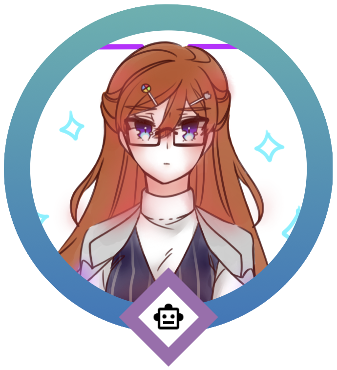

<!-- PROJECT SHIELDS -->
![Status][status-shield]
[![Forks][forks-shield]][forks-url]
[![Stargazers][stars-shield]][stars-url]
[![GNU GPLv3.0][license-shield]][license-url]
[![LinkedIn][linkedin-shield]][linkedin-url]

<!-- PROJECT LOGO -->
 

  

<h3 align="center">Henrietta</h3>

  

    My personal, multi-functional Discord companion bot.
     
    <a href="https://github.com/Nelliosis/Henrietta-bot/wiki"><strong>Explore the Wiki »</strong></a>
     
     
  

<!-- TABLE OF CONTENTS -->

  
Table of Contents

  <ol>
    <li>
      <a href="#about-the-project">About The Project</a>
      <ul>
        <li><a href="#built-with">Built With</a></li>
      </ul>
    </li>
    <li>
      <a href="#getting-started">Getting Started</a>
      <ul>
        <li><a href="#prerequisites">Prerequisites</a></li>
        <li><a href="#installation">Installation</a></li>
      </ul>
    </li>
    <li><a href="#usage">Usage</a></li>
    <li><a href="#roadmap">Roadmap</a></li>
    <li><a href="#make-it-your-own">Make It Your Own</a></li>
    <li><a href="#license">License</a></li>
    <li><a href="#contact">Contact</a></li>
    <li><a href="#acknowledgments">Acknowledgments</a></li>
  </ol>

<!-- ABOUT THE PROJECT -->
## About The Project

[![Product Name Screen Shot][product-screenshot]](https://example.com)

Henrietta is my personal discord bot. I initially made her as a submission to [CS50](https://www.edx.org/course/introduction-computer-science-harvardx-cs50x), an online course by Harvard University. I wanted something that can simplify my day-to-day activities. 

She features three main functions:
* Play, queue, shuffle and search music
* do polls
* make scheduled events

These are the three main functions I find useful. I will update the bot as I see fit. \
If you want to add more functionality to the bot, fork the bot and [make it your own](#make-it-your-own). Set up the project by following the [Getting Started Section](#getting-started)

(<a href="#top">back to top</a>)

### Built With

* [Node.js](https://nodejs.org/en/)
* [Discord.js](https://discord.js.org/#/)

(<a href="#top">back to top</a>)

<!-- GETTING STARTED -->
## Getting Started

(_under construction_)

### Prerequisites

(_under construction_)

### Installation

(_under construction_)

(<a href="#top">back to top</a>)

<!-- USAGE EXAMPLES -->
## Usage

(_under construction_)

_For more command examples, please refer to the [Wiki](https://github.com/Nelliosis/Henrietta-bot/wiki)_

(<a href="#top">back to top</a>)

<!-- ROADMAP -->
## Roadmap

As I continue developing my bot, I will update this Roadmap.

- [x] Basic Functionality
  - [x] Replies with Hello
  - [x] Can accept new commands
  - [x] Receives and parses events
- [x] Music
  - [x] Search
    - [x] With link
      - [x] By Spotify
      - [x] By YouTube
    - [x] With query
  - [x] Play
    - [x] With link
    - [x] With query
  - [ ] Error handling
  - [ ] Queue
    - [ ] Shuffle
    - [ ] Enqueue
    - [ ] Dequeue
    - [ ] Modify segment of existing queue
    - [ ] Enqueue a certain specific amount of tracks
    - [ ] Specify which track to enqueue
- [ ] Replies
  - [ ] Shows 'Now Playing'
  - [ ] Shows metadata [title, length]
  - [ ] Shows Queue
- [ ] Polling
  - [ ] Add options to poll
  - [ ] Delete options to poll
- [ ] Calendar Scheduling to Google Calendar
  - [ ] Create a calendar event
  - [ ] Send a message to attendee a Google Calendar event invitation

(<a href="#top">back to top</a>)

<!-- CONTRIBUTING -->
## Make It Your Own

If you want to:

1. add your own functionality
2. modify the code
3. tinker with the bot 

then by all means _**fork**_ the project. You need not to contribute back to this main project. You are free to make it your own. Use the [Getting Started](#getting-started) section to get you up and running with the bot's development. \
Though please do remember to credit my work.

### Note:
The artwork and logo are my personal property, thus their images cannot be used in your forks. I recommend branding the bot as something different altogether.

(<a href="#top">back to top</a>)

<!-- LICENSE -->
## License

Distributed under version 3.0 of the GNU General Public License. Visit the [license](https://github.com/Nelliosis/Henrietta-bot/blob/main/LICENSE) for more information.

(<a href="#top">back to top</a>)

<!-- CONTACT -->
## Contact

Reach me through my [LinkedIn](https://linkedin.com/in/jcapawing) or email me directlty at `under construction`

Project Link: [https://github.com/Nelliosis/Henrietta-bot](https://github.com/Nelliosis/Henrietta-bot)

(<a href="#top">back to top</a>)

<!-- ACKNOWLEDGMENTS -->
## Acknowledgments

I am incredibly thankful to the following resources and people for helping me throughout the development process:

* Art
  * My original character Henrietta, was designed and made by [Seruneechan](https://twitter.com/Seruneechan).

* Markdown Resources
  * [Othneildrew's Best Readme Template](https://github.com/othneildrew/Best-README-Template)
  * [ikatyang's Emoji Cheat Sheet for GitHub Markdown](https://github.com/ikatyang/emoji-cheat-sheet/blob/master/README.md)
  * [Markdown Guide](https://www.markdownguide.org/basic-syntax/#reference-style-links)
  * [GitHub Markdown Guide](https://enterprise.github.com/downloads/en/markdown-cheatsheet.pdf)
* Guides & Documentation
  * [niconiconii's / 3chospirits's Discord Bot YouTube Tutorial Series](https://www.youtube.com/playlist?list=PLOlSzPEdp-bRnCzZX6qnKehutm2nb_tN-)
  * [Discord.js Guide](https://discordjs.guide/#before-you-begin)
  * [Discord.js Documentation](https://discord.js.org/#/docs/discord.js/stable/general/welcome)
  * [Mozilla's JavaScript Documentation](https://developer.mozilla.org/en-US/docs/Web/JavaScript)
  * [javascript.info: The Modern JavaScript Tutorial](https://javascript.info/)

* Miscellaneous
  * [Shields.io](https://shields.io/category/license)
  * [Visual Studio Code](https://code.visualstudio.com/)
  * [Toptal's Gitignore.io](https://www.toptal.com/developers/gitignore)

(<a href="#top">back to top</a>)

<!-- MARKDOWN LINKS & IMAGES -->
<!-- https://www.markdownguide.org/basic-syntax/#reference-style-links -->
[forks-shield]: https://img.shields.io/github/issues/Nelliosis/Henrietta-bot?style=for-the-badge
[forks-url]: https://github.com/Nelliosis/Henrietta-bot/network/members
[stars-shield]: https://img.shields.io/github/stars/Nelliosis/Henrietta-bot?style=for-the-badge
[stars-url]: https://github.com/Nelliosis/Henrietta-bot/stargazers
[license-shield]: https://img.shields.io/github/license/Nelliosis/Henrietta-bot?style=for-the-badge
[license-url]: https://github.com/Nelliosis/Henrietta-bot/blob/main/LICENSE
[linkedin-shield]: https://img.shields.io/badge/-LinkedIn-black.svg?style=for-the-badge&logo=linkedin&colorB=555
[linkedin-url]: https://linkedin.com/in/jcapawing
[product-screenshot]: images/screenshot.png
[status-shield]: https://img.shields.io/badge/Status-Under%20Development-orange?style=for-the-badge
